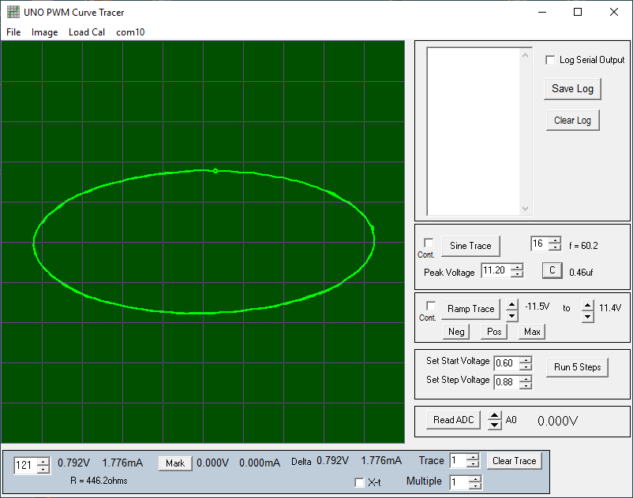
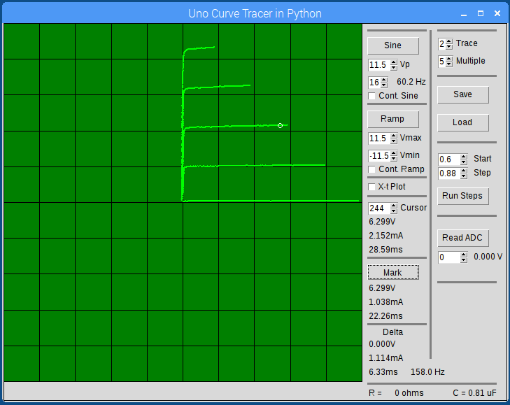

# Component-Curve-Tracer

Uno based bipolar +-12V sine wave curve tracer. Uses PWM to generate sine and step waveforms.

Circuit built with Dual Op Amp, resistors and capacitors. 

Power: Needs four 9V batteries or a 5V to +-15 DC to DC converter. 

Windows(R) Application: uno_pwm_ct.exe for viewing waveforms (includes source code).

Raspberry Pi model 3 Application: un_pwm_ct (Change file permissions to Execute: Anyone to run)

Experimental Python 3 appliclation uno_ct_v2.py for Raspberry Pi 3

Arduino sketch and Fritzing file to aid building.

