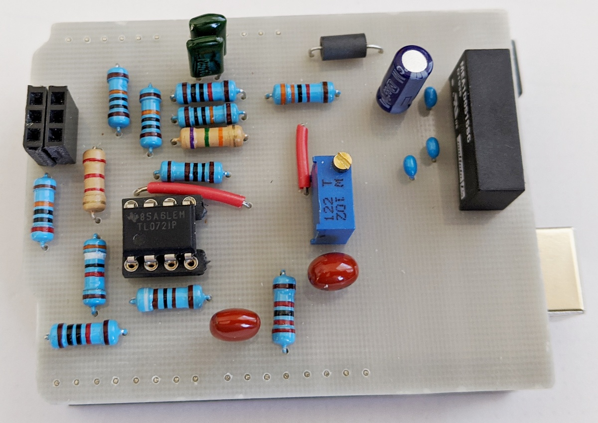

# Component-Curve-Tracer

Uno based bipolar +-12V sine wave curve tracer. Uses PWM to generate sine and step waveforms.

Circuit built with Dual Op Amp, resistors and capacitors. 

Power: Needs four 9V batteries or a 5V to +-15 DC to DC converter. 

Windows(R) Application: uno_pwm_ct.exe for viewing waveforms (includes Pascal source code).

Raspberry Pi model 3 Linux Application: un_pwm_ct (Change file permissions to Execute: Anyone to run)

Raspberry Pi Python 3 Appliclation: uno_ct_v2.py

Arduino sketch, Fritzing file, and CNC milling/drill files to aid building.

